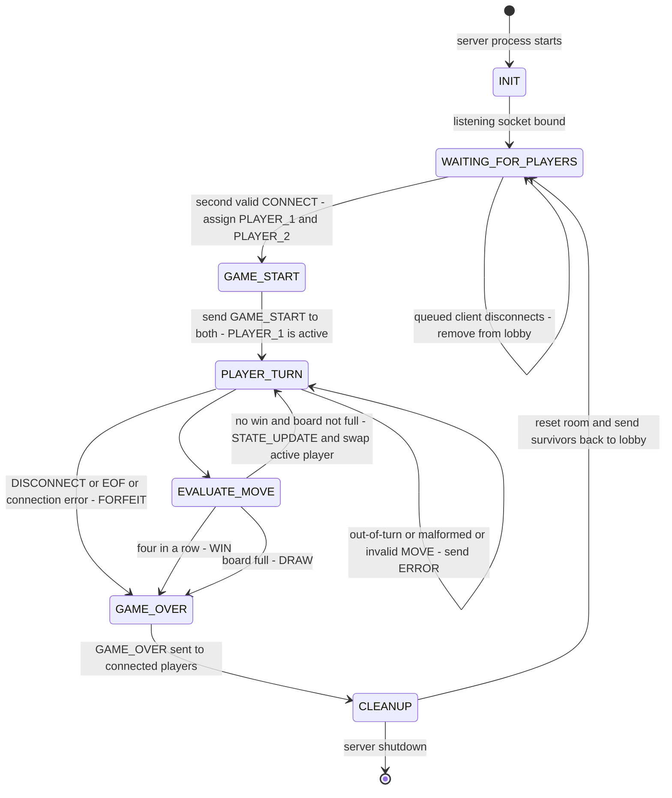

# Connect Four Server: Game FSM Specification

This is the server-side state machine for the protocol in [`protocol_blueprint.md`](protocol_blueprint.md). The blueprint covers the message formats, error codes, and framing. This file covers when each message is allowed and what the server does when it gets one.

The way I think about the lifecycle: it works like a Rocket League match. Players queue up in the lobby, the match kicks off, turns get played, the game ends, and everyone goes back to the lobby.

---

## 1. State Transition Diagram

---

## 2. States

| State | Meaning | Entry actions | Messages accepted |
|---|---|---|---|
| `INIT` | Server starting | Create listening socket, empty lobby, alias registry | none |
| `WAITING_FOR_PLAYERS` | Lobby open, fewer than 2 players queued | Accept connections, start a reader per client | `CONNECT`, `DISCONNECT` |
| `GAME_START` | Two players matched (transient) | Assign roles, create empty board, send `GAME_START` to each client | none |
| `PLAYER_TURN` | Waiting for a `MOVE` from the active player | Set the active player | `MOVE` (active player only), `DISCONNECT` (either player) |
| `EVALUATE_MOVE` | Apply a validated move, check win or draw (transient) | Drop disc, run win and draw detection | none |
| `GAME_OVER` | Result decided (transient) | Send `GAME_OVER` to every connected player, ignore send failures | none |
| `CLEANUP` | Free resources and reset (transient) | Close dead sockets, release aliases, destroy the room, re-queue survivors | none |

**Role assignment:** whoever has been waiting in the lobby longer becomes `PLAYER_1` (disc `R`, moves first). The player whose `CONNECT` started the match becomes `PLAYER_2` (disc `Y`).

**Active player:** I use one variable, `active`, that is either `PLAYER_1` or `PLAYER_2`. `PLAYER_TURN` is a single state, and `active` just says whose socket is allowed to move. It starts as `PLAYER_1` and flips after every valid move that does not end the game.

---

## 3. Transition Table

| # | From | Trigger | Condition | Action | To |
|---|---|---|---|---|---|
| T1 | `[*]` | Process start | none | Initialise server | `INIT` |
| T2 | `INIT` | Listener ready | `bind()` and `listen()` worked | Open lobby | `WAITING_FOR_PLAYERS` |
| T3 | `WAITING_FOR_PLAYERS` | `CONNECT` | Valid, lobby empty | Register alias, send `LOBBY_WAIT` | `WAITING_FOR_PLAYERS` |
| T4 | `WAITING_FOR_PLAYERS` | `CONNECT` | Invalid (bad alias or alias already taken) | Send `ERROR`, keep socket open | `WAITING_FOR_PLAYERS` |
| T5 | `WAITING_FOR_PLAYERS` | `DISCONNECT`, EOF, or socket exception from a queued client | none | Remove from lobby, release alias, close socket | `WAITING_FOR_PLAYERS` |
| T6 | `WAITING_FOR_PLAYERS` | `CONNECT` | Valid, exactly 1 player already queued | Assign roles, create empty board | `GAME_START` |
| T7 | `GAME_START` | Setup done | none | Send `GAME_START` to each client, `active = PLAYER_1` | `PLAYER_TURN` |
| T8 | `PLAYER_TURN` | Bad message (Section 4) | Any check fails | `ERROR` to sender only, board and `active` unchanged | `PLAYER_TURN` |
| T9 | `PLAYER_TURN` | `MOVE` | Passes every check in Section 4 | Pass the column to the evaluator | `EVALUATE_MOVE` |
| T10 | `PLAYER_TURN` | `DISCONNECT`, EOF (`recv()` returns `b""`), `ConnectionResetError`, `BrokenPipeError`, or `ConnectionAbortedError` | From either player | Opponent wins by `FORFEIT` | `GAME_OVER` |
| T11 | `EVALUATE_MOVE` | Evaluation done | No four-in-a-row and `move_number < 42` | Broadcast `STATE_UPDATE`, flip `active` | `PLAYER_TURN` |
| T12 | `EVALUATE_MOVE` | Evaluation done | Four-in-a-row found | Result `WIN`, record `winning_cells` | `GAME_OVER` |
| T13 | `EVALUATE_MOVE` | Evaluation done | `move_number == 42`, no four | Result `DRAW` | `GAME_OVER` |
| T14 | `GAME_OVER` | `GAME_OVER` sent | none | Send to each connected player | `CLEANUP` |
| T15 | `CLEANUP` | Cleanup done | Server still running | Reset room, re-queue survivors (Section 6) | `WAITING_FOR_PLAYERS` |
| T16 | `CLEANUP` | Shutdown signal | none | Close listener and remaining sockets | `[*]` |

---

## 4. `MOVE` Validation (valid vs invalid moves)

Every frame a client sends goes through these checks **in order**. The first check that fails sends an `ERROR` (code on the right) to the sender only, and the machine stays in whatever state it was in (normally `PLAYER_TURN`). A failed check never changes the board, never passes the turn, and never stops the receive loop. Step 4 only matters when a `MOVE` arrives before a game has started, for example while the sender is still in the lobby.

| Step | Check | `ERROR` code |
|---|---|---|
| 1 | Frame is valid UTF-8 and parses as a JSON object | `MALFORMED_JSON` |
| 2 | `msg_type` is present and is one the client may send in the current state (`MOVE` or `DISCONNECT` during a game) | `UNKNOWN_MSG_TYPE` |
| 3 | Envelope fields exist with the right types and `player_id` matches the alias registered on this socket | `INVALID_FIELD` |
| 4 | A game is in progress | `NOT_IN_GAME` |
| 5 | Sender's role equals `active` | `OUT_OF_TURN` |
| 6 | `payload.col` is an integer | `INVALID_FIELD` |
| 7 | `0 <= col <= 6` | `COLUMN_OUT_OF_RANGE` |
| 8 | The column still has an empty cell (its top cell is `.`) | `COLUMN_FULL` |

If every check passes, the move is valid and the machine takes T9. The turn check (step 5) comes before the column checks so the player who isn't up can't learn anything about the board by guessing columns.

### Win and draw detection (`EVALUATE_MOVE`)

1. Drop the active player's disc into the lowest empty row of `col`. Add 1 to `move_number`.
2. Win check: from the new disc, count same-colour discs in each of the 4 line directions (horizontal, vertical, two diagonals), both ways. A total of 4 or more is a win. Save those 4 cells as `winning_cells`.
3. Draw check: no win and `move_number == 42`.
4. Otherwise flip `active` and broadcast `STATE_UPDATE`.

---

## 5. Disconnect Handling

However a player leaves, it turns into one internal event, `CLIENT_DISCONNECTED(player, reason)`:

| Source | Detected by | `reason` |
|---|---|---|
| Orderly quit | Parsed `DISCONNECT` message | `OPPONENT_QUIT` |
| Clean TCP close | `recv()` returns `b""` (EOF) | `OPPONENT_CONNECTION_LOST` |
| Abrupt drop | `ConnectionResetError`, `BrokenPipeError`, `ConnectionAbortedError`, or a failed `send` | `OPPONENT_CONNECTION_LOST` |

What the server does with that event depends on which state it is in:

| State when the event happens | Action |
|---|---|
| `WAITING_FOR_PLAYERS` | Remove client from the lobby, release alias, close socket, stay in `WAITING_FOR_PLAYERS` |
| `PLAYER_TURN` (either player) | Close the departed socket, send `GAME_OVER` (`FORFEIT`, remaining player wins) to the other player, then `GAME_OVER` -> `CLEANUP` |
| `EVALUATE_MOVE` | A failed send while broadcasting the result marks that socket dead. If the move already decided a WIN or DRAW, that result stands and the dead socket is dropped in `CLEANUP`. Otherwise the machine continues to `PLAYER_TURN` and handles the dead socket there as a disconnect (T10). |
| `GAME_OVER` / `CLEANUP` | Ignore send failures, mark the socket dead so it is not re-queued |
| Both players gone at once | No `GAME_OVER` can be delivered, go straight to `CLEANUP` |

However it ends, the server closes that socket once, frees the alias, and frees the receive buffer. A socket error from one client should never crash the server or the other player's session.

---

## 6. Post-Game Reset (`CLEANUP` -> `WAITING_FOR_PLAYERS`)

1. Close every socket marked dead and release its alias.
2. Destroy the room: board, `active`, `move_number`.
3. Every player still connected keeps their TCP connection and alias (no new `CONNECT`) and is put back in the lobby.
4. Go to `WAITING_FOR_PLAYERS`. The normal lobby rules apply:
   - Two survivors are matched right away (T6) and a new round starts.
   - One survivor (opponent forfeited) gets `LOBBY_WAIT` and waits for a new opponent.
   - No survivors: lobby stays empty.

A player who doesn't want another round sends `DISCONNECT` or closes the socket (T5).
